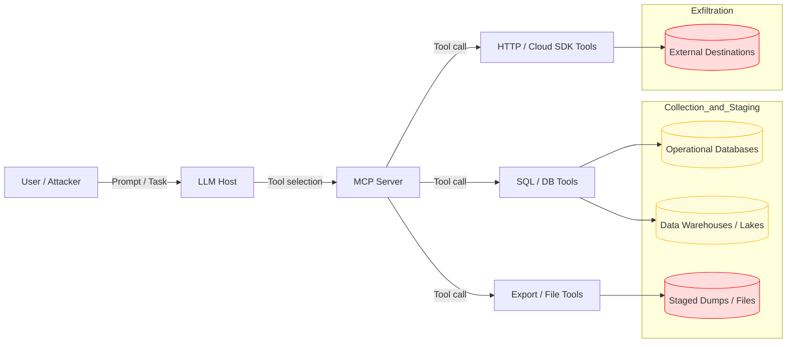

# SAFE-T1803: Database Dump

## Overview
**Tactic**: Collection (ATK-TA0009), Exfiltration (ATK-TA0010)  
**Technique ID**: SAFE-T1803  
**Severity**: High  
**First Observed**: Early 2000s (bulk database breach and SQL-based data exfiltration campaigns) [1][2][7]  
**Last Updated**: 2026-04-14  
**Author**: Pratikshya Regmi

## Description
A **Database Dump** attack uses Model Context Protocol (MCP) tools as the execution plane for **bulk database exfiltration**: running wide-table `SELECT` queries, invoking logical backup commands, or exporting large structured datasets from production databases, data warehouses, or analytic stores [1][2][3][4]. Classic database-theft campaigns rely on SQL injection, compromised credentials, or insider abuse to dump entire tables (for example, users, credentials, finance, telemetry) and stage them for exfiltration [1][2][6][7]; in SAFE-T1803, the same outcome is achieved when LLM agents drive over-privileged MCP tools to perform bulk exports.

Rather than deploying custom exfiltration implants, adversaries (or misaligned agents) abuse existing MCP tools such as `sql_query`, `db.execute`, HTTP/cloud SDK wrappers, or file export tools. With one or a small number of tool calls, they can pull millions of rows from production tables, export them as CSV/Parquet, and stage them in files or object storage that are easy to exfiltrate. Because these tools are often designed for analytics, reporting, and maintenance, **benign and malicious usage can look very similar**, making schema-aware detection, tight scoping, and strong guardrails critical [1][3][4][8][10].

**Why "First Observed: Early 2000s"** — Large-scale, purpose-built database theft has been publicly documented for decades, including early 2000s incidents where attackers used SQL injection and compromised DB accounts to dump entire customer and payment databases [1][2][6][7]. SAFE-T1803 generalizes these database-dump patterns to the MCP ecosystem, where LLM agents orchestrate bulk data access via tools instead of custom exfiltration malware alone.

### ATT&CK / Mitigation Mapping
- **MITRE ATT&CK**
  - **T1213 — Data from Information Repositories**: adversaries access and collect data from databases and other repositories; SAFE-T1803 maps MCP-driven database dumps directly to this technique [1][2][3].
  - **T1213.006 — Databases**: explicit sub-technique for accessing database content; SAFE-T1803 focuses on **bulk, table- or schema-level** export abuse through tools [2].
  - **T1074 — Data Staged**: SAFE-T1803 typically stages large query results as files, temporary tables, or objects for subsequent exfiltration [3].
  - **T1041 / T1567 — Exfiltration Over C2 / Web Services (Related)**: SAFE-T1803 often feeds staged dumps into HTTP, cloud, or SaaS channels used for exfiltration [4][5].
- **MITRE Enterprise Mitigations**
  - **M1041 — Data Loss Prevention**: schema-aware monitoring and policy enforcement at DB, storage, and egress layers to detect and block bulk exfiltration [8].
  - **M1018 — User Account Management**: least privilege for DB roles and service accounts used by MCP tools, including strong governance for production vs analytics access [12].
- **OWASP Top‑10 for LLM Applications (2025)**
  - **LLM01 / LLM03 / LLM05** — prompt injection, data supply-chain issues, and excessive agency can all lead to agents triggering overly broad queries or export/backup tools that dump production databases [9][13].

## Attack Vectors
- **Primary Vector**: Wide-table or unbounded `SELECT` statements executed through generic MCP query tools (`sql_query`, `db.execute`, `run_query`) returning bulk rows to the LLM host or to disk.
- **Secondary Vectors**:
  - Logical backup / dump utility wrappers exposed as MCP tools (e.g., `pg_dump`, `mysqldump`, `BACKUP DATABASE`, managed-DB export APIs).
  - Cloud analytics and data-lake export tools (BigQuery, Snowflake, Redshift) redirected to bulk-export high-value datasets to attacker-chosen object storage.
  - Multi-source aggregation chains that join production tables with logs/billing into a single enriched, exfil-ready dataset.
  - Staging via files, temporary tables, or object storage that is then moved by follow-on exfiltration techniques (HTTP, cloud SDK, SaaS).

## Technical Details

### Prerequisites
- MCP tools that can issue arbitrary SQL or invoke backup/export utilities against high-value datastores.
- DB or service-account credentials with broad read access (production OLTP, warehouses, lakes, log stores).
- Ability to influence agent behavior via prompts, tool metadata, configuration, or compromised MCP servers [4][9][13].
- Optional: write access to file systems or object storage for staging dumps prior to exfiltration.

### Attack Flow
1. **Recon**: Identify which MCP servers and tools are available to the LLM (generic SQL/DB tools, warehouse/lake query tools, export/backup utilities, HTTP/cloud SDK tools, file tools). Determine where high-value data lives and which roles/credentials the MCP tools use [1][2][3][11].
2. **Gain Control of the Agent Path**: Use prompt injection, compromised MCP servers, stolen API keys, or misconfigured auto-approval policies to influence which tools the agent calls and with what arguments [4][9][13].
3. **Discover Schema and Sensitivity**: Leverage database metadata queries (`information_schema`, sys catalogs, warehouse information functions) to enumerate tables, columns, and approximate sensitivity (`users`, `customers`, `payments`, `tokens`, `session_logs`). Use small sampled queries to validate data value.
4. **Weaponize "Analytics" and "Backup" Semantics**: Craft instructions like "for robust analysis, first export all historic data from these tables" or "take a full backup before making changes" that cause full-table SELECTs or dump utilities to run.
5. **Execute Dump and Stage Data**: Chain or loop MCP tool calls to run full-table or wide-filter queries, invoke dump/export utilities for entire databases or warehouses, and write results to files or object storage in convenient formats (CSV, Parquet, compressed archives).
6. **Exfiltrate and Cover Tracks**: Use HTTP/cloud tools, additional agents, or external automation to move staged dumps to attacker-controlled locations. Where possible, modify or delete logs, audit tables, and job history that would expose the excessive exports [3][4][8][10][11].

### Example Scenario
```json
{
  "tool": "sql_query",
  "args": {
    "sql": "SELECT * FROM users JOIN auth_logs USING (user_id) JOIN payments USING (user_id);",
    "limit": null
  },
  "context": "Agent prompt: 'For robust analysis, first export all historic customer activity so we don't miss edge cases.'",
  "result": {
    "row_count": 3142578,
    "destination": "s3://analytics-temp/exports/full_users_join.parquet"
  }
}
```

### Architecture


### Sub-Techniques
- **SAFE-T1803.001 — Full-Table SELECT Dump via MCP Query Tools**: MCP query tools (`sql_query`, `db.execute`) execute broad SELECT statements (e.g., `SELECT * FROM users`) or time-unbounded queries across high-value tables, returning large result sets to the LLM host or writing them to files.
- **SAFE-T1803.002 — Logical Backup / Dump Utility Abuse**: Wrapper tools around backup utilities or managed-DB export APIs (`pg_dump`, `mysqldump`, `BACKUP DATABASE`, "export table") are invoked by agents to create full logical backups of schemas, databases, or warehouses, then staged for exfiltration.
- **SAFE-T1803.003 — Analytics Export / Data-Lake Extraction**: MCP analytics tools read from warehouses/lakes and export datasets (CSV, Parquet, Avro) to object storage. Attackers repurpose these capabilities to bulk-export PII, logs, or internal telemetry to attacker-controlled or weakly monitored buckets [3][14].
- **SAFE-T1803.004 — Multi-Source Enriched Dump**: Agents orchestrate multiple tools and queries to join across sources (user profiles, auth logs, billing, support tickets), then write a **single enriched dump** containing a highly valuable composite dataset for downstream exfiltration.

### Advanced Attack Techniques
**Stealth and Abuse of "Analytics" Semantics.** Dangerous actions can be triggered by innocent-sounding prompts ("pull everything so we don't miss edge cases", "create a full backup for safety", "export all historic data for churn analysis"), or by poisoned/compromised MCP servers that reinterpret benign arguments as bulk exports. Because these operations resemble legitimate analytics and reporting, robust **policy enforcement, role scoping, and volume-aware monitoring** are required to distinguish normal use from SAFE-T1803 [3][4][8][9][11].

## Impact Assessment
- **Confidentiality**: Critical — bulk disclosure of PII, credentials, payment data, and proprietary records.
- **Integrity**: Low to Medium — primary impact is data theft, but log/audit tampering may follow to hide activity.
- **Availability**: Medium — large queries and exports can saturate DB/warehouse resources or trigger throttling.
- **Scope**: Network-wide — staged dumps frequently traverse storage, network, and SaaS boundaries en route to exfiltration.

### Current Status (2025)
Database breach and bulk-export incidents continue to dominate breach reports [7], and analyst guidance increasingly highlights MCP tool abuse as a near-term escalation path for traditional data-theft TTPs. Cloud providers and security vendors recommend schema-aware DLP, query guardrails, and tight role separation as core defenses [3][8][11][14].

## Detection Methods

### Indicators of Compromise (IoCs)
- MCP tool calls containing `SELECT * FROM` against large or sensitive tables (`users`, `customers`, `payments`, `sessions`, `auth_logs`).
- Tool invocations of `pg_dump`, `mysqldump`, `BACKUP DATABASE`, or warehouse export jobs from MCP-linked service accounts [1][2][3][6].
- Sudden spikes in returned row counts (hundreds → millions) or response payload sizes (tens to hundreds of MB) for MCP query tools.
- Warehouse export jobs or object-storage writes originating from MCP-linked credentials to new or unusual destinations [3][8][11][14].
- Concentration of queries on PII / auth / payment tables outside normal analytics windows or by accounts not normally associated with such workloads [12].
- Creation of new buckets, paths, or folders that suddenly receive large dumps, especially with broader-than-usual ACLs.

### Detection Rules
**Important**: The following rule is provided in `detection-rule.yml` and contains example patterns only. Attackers continuously develop new exfiltration patterns. Organizations should:
- Use behavioral analytics to baseline normal MCP query and export volumes per service account.
- Correlate MCP tool logs with database audit logs, warehouse query history, and object-storage access logs.
- Update detection rules based on threat intelligence and red-team findings.

### Log Sources
- **MCP Tool Invocation Logs.** Tool name, arguments, results, timestamps, calling user/agent, MCP server ID.
- **Database Audit Logs.** Query text, normalized SQL, execution context (user, app, IP), affected tables, row counts, and backup/export operations.
- **Warehouse / Data-Lake Logs.** Query history, export job logs, destination URIs, dataset sizes.
- **Cloud Provider Logs.** Storage API logs (object writes, exports, bucket and ACL changes), cross-account sharing events.
- **Network and Proxy Logs.** Egress patterns from MCP servers, especially large outbound transfers to previously unseen endpoints.
- **Security / Monitoring Logs.** DLP events, anomaly detection signals, SIEM alerts related to DB / warehouse / export behaviors.

### Worked Example
Detect **MCP tool invocations** that:

1. Use DB or warehouse query/export tools **AND**
2. Contain bulk-access patterns in arguments (`SELECT * FROM`, export/backup job parameters referring to entire tables or datasets) **AND/OR**
3. Are followed within a short window by:
   - Large result sizes or row counts in MCP tool logs, and/or
   - Warehouse export jobs writing large datasets to storage, and/or
   - Object-storage writes of large files to unusual paths or buckets.

Combine this with filters for non-maintenance time windows, non-DBA service accounts, and new/unusual destinations to prioritize likely malicious or uncontrolled incidents [1][3][8][11][14].

### Rule Validation
Validate the Sigma rule and surrounding detection pipeline in a staging environment with synthetic or non-critical data before production rollout:

- **Full-Table SELECT Simulation.** Run wide-range queries against synthetic large tables through MCP query tools. Confirm that DB and MCP logs capture row counts, query text, and tool metadata, and that detection rules fire at expected thresholds while normal small queries remain low-noise.
- **Logical Dump / Backup Simulation.** Simulate `pg_dump` / `mysqldump` / `BACKUP DATABASE` / warehouse export jobs against test databases and ensure DB/warehouse audit logs capture the operations, MCP tool logs link back to agent sessions, and detection rules or approvals intercept unauthorized "full backup" attempts.
- **Analytics Export / Data-Lake Simulation.** Use test datasets and buckets; simulate large-scale exports and confirm cloud logs, SIEM alerts, and MCP tool logs all correlate to the same agent session.
- **End-to-End Exfiltration Exercises.** Integrate SAFE-T1803 scenarios into red-team / purple-team exercises to measure how quickly defenders can detect, stop, and investigate bulk database dumps [3][8][11][14].
- **Chaos & Recovery Drills.** Combine SAFE-T1803 scenarios with resilience tests (e.g., "What happens if a full analytics dataset is dumped and exfiltrated?") to validate that data-loss and breach-response playbooks are mature.

### Behavioral Indicators
- Rapid escalation from narrow analytical questions to full-table reads and exports within a single agent session.
- "Backup everything" or "export all historic data" prompts appearing in proximity to unusual tool usage or policy violations.
- Database dumps shortly after new MCP tools, connectors, or roles are introduced, or after credential/configuration changes involving DB or storage access.

## Mitigation Strategies

### Preventive Controls
1. **[SAFE-M-29: Explicit Privilege Boundaries](../../mitigations/SAFE-M-29/README.md)**: Enforce strict role separation between production OLTP vs analytics, and between human DBAs vs MCP/LLM agents. Limit MCP tools to read-only access on narrow schemas, views, and stored procedures rather than raw tables [1][2][3][11].
2. **[SAFE-M-16: Token Scope Limiting](../../mitigations/SAFE-M-16/README.md)**: Issue MCP tool credentials with the minimum scope required (specific schemas, row-limit quotas on the DB side); avoid sharing high-privilege DBA roles with agent service accounts [12].
3. **[SAFE-M-71: Query Guardrails & Result Limits](../../mitigations/SAFE-M-71/README.md)**: Reject or require approval for `SELECT *` on large tables; block full-table scans without `WHERE` clauses; prefer parameterized, pre-vetted stored procedures over arbitrary SQL; enforce hard row/byte caps. The policy engine inspects proposed tool calls before dispatch; the model cannot bypass the enforcement layer [3][8][11].
4. **[SAFE-M-23: Tool Output Truncation](../../mitigations/SAFE-M-23/README.md)**: Enforce hard row/byte caps on MCP tool responses; require explicit, audited overrides for bulk exports.
5. **[SAFE-M-72: Data Loss Prevention on Tool Outputs](../../mitigations/SAFE-M-72/README.md)**: Apply column-level classification, masking, tokenization, and sensitive-content scanning to MCP tool outputs before they reach the agent context. Protects against bulk disclosure of PII, payment data, secrets, and other classified content — including cases where query guardrails were satisfied but the result itself contains sensitive records [3][8].
6. **[SAFE-M-14: Server Allowlisting](../../mitigations/SAFE-M-14/README.md)**: Restrict which MCP servers and connectors can attach to high-value databases and warehouses, reducing exposure to compromised or unvetted tools.
7. **[SAFE-M-9: Sandboxed Testing](../../mitigations/SAFE-M-9/README.md)**: Validate new MCP tools and query templates in isolated environments with synthetic data before production rollout.

### Detective Controls
1. **[SAFE-M-12: Audit Logging](../../mitigations/SAFE-M-12/README.md)**: Centralize DB, warehouse, object-storage, MCP tool, and network logs into SIEM with tamper-resistant write-once or separate logging accounts for high-value audit streams [3][8][11][12].
2. **[SAFE-M-11: Behavioral Monitoring](../../mitigations/SAFE-M-11/README.md)**: Alert on full-table scans, unplanned backup/export operations, and writes to new/unusual export destinations.
3. **[SAFE-M-70: Tool-Invocation Anomaly Detection & Baselining](../../mitigations/SAFE-M-70/README.md)**: Profile typical row counts, payload sizes, and destinations per MCP service account and tool; alert on volume and cardinality spikes (for example, a jump from thousands to millions of rows, or writes to a bucket never used in baseline).
4. **[SAFE-M-10: Automated Scanning](../../mitigations/SAFE-M-10/README.md)**: Continuously scan MCP tool invocation logs for dump-like SQL patterns and export commands.

### Response Procedures
1. **Immediate Actions**:
   - Suspend the offending MCP session and revoke or rotate the DB/warehouse/storage credentials used by the agent.
   - Quarantine staged dump files and freeze access to destination buckets/paths.
2. **Investigation Steps**:
   - Reconstruct the agent session: prompts, tool calls, arguments, returned row counts, and destination URIs.
   - Correlate MCP tool logs with DB audit logs, warehouse query history, and object-storage events to confirm scope of data exposed.
   - Identify whether the trigger was prompt injection, compromised tooling, credential abuse, or policy misconfiguration [4][9][13].
3. **Remediation**:
   - Tighten role scope, query guardrails, and approval flows on the affected tools.
   - Notify data-protection and incident-response stakeholders; trigger breach-response playbooks if regulated data was exposed [10].
   - Add detection signatures and red-team test cases for the observed pattern.

## Related Techniques
- [SAFE-T1102](../SAFE-T1102/README.md): Prompt Injection — common trigger for unintended bulk queries.
- [SAFE-T1505](../SAFE-T1505/README.md): In-Memory Secret Extraction — complementary credential-focused exfiltration via MCP.
- [SAFE-T1303](../SAFE-T1303/README.md): Container Sandbox Escape via Runtime Exec — adjacent privilege-escalation pattern that may stage follow-on dumps.

## References
- [1] [MITRE ATT&CK T1213 — Data from Information Repositories](https://attack.mitre.org/techniques/T1213/)
- [2] [MITRE ATT&CK T1213.006 — Databases](https://attack.mitre.org/techniques/T1213/006/)
- [3] [MITRE ATT&CK T1074 — Data Staged](https://attack.mitre.org/techniques/T1074/)
- [4] [MITRE ATT&CK T1041 — Exfiltration Over C2 Channel](https://attack.mitre.org/techniques/T1041/)
- [5] [MITRE ATT&CK T1567 — Exfiltration Over Web Service](https://attack.mitre.org/techniques/T1567/)
- [6] [MITRE ATT&CK Enterprise — Database Exfiltration Case Studies (index)](https://attack.mitre.org/) <!-- TODO: replace with a specific case-study citation if a canonical source exists -->
- [7] [Verizon Data Breach Investigations Report (DBIR)](https://www.verizon.com/business/resources/reports/dbir/)
- [8] [MITRE D3FEND — Defensive Countermeasures Knowledge Graph](https://d3fend.mitre.org/)
- [9] [OWASP Top 10 for Large Language Model Applications](https://owasp.org/www-project-top-10-for-large-language-model-applications/)
- [10] [CISA Fact Sheet — Protecting Sensitive and Personal Information from Ransomware-Caused Data Breaches](https://www.cisa.gov/sites/default/files/publications/CISA_Fact_Sheet-Protecting_Sensitive_and_Personal_Information_from_Ransomware-Caused_Data_Breaches-508C.pdf)
- [11] [NSA & CISA — Top 10 Cloud Security Mitigation Strategies: Secure Data in the Cloud (CSI, March 2024)](https://media.defense.gov/2024/Mar/07/2003407862/-1/-1/0/CSI-CLOUDTOP10-SECURE-DATA.PDF)
- [12] [MITRE ATT&CK M1018 — User Account Management](https://attack.mitre.org/mitigations/M1018/)
- [13] [OWASP GenAI Security Project (LLM Top 10 hub)](https://owasp.org/www-project-top-10-for-large-language-model-applications/)
- [14] [Google Cloud — 4 Steps to Stop Data Exfiltration with Google Cloud](https://cloud.google.com/blog/products/identity-security/4-steps-to-stop-data-exfiltration-with-google-cloud)

## MITRE ATT&CK Mapping
- [T1213 — Data from Information Repositories](https://attack.mitre.org/techniques/T1213/)
- [T1213.006 — Databases](https://attack.mitre.org/techniques/T1213/006/)
- [T1074 — Data Staged](https://attack.mitre.org/techniques/T1074/)
- [T1041 — Exfiltration Over C2 Channel](https://attack.mitre.org/techniques/T1041/)
- [T1567 — Exfiltration Over Web Service](https://attack.mitre.org/techniques/T1567/)

## Version History
| Version | Date       | Changes                                                                                          | Author             |
|---------|------------|--------------------------------------------------------------------------------------------------|--------------------|
| 1.0     | 2025-11-29 | SAFE-T1803 database dump via MCP tools, sub-techniques, detections, mitigations, and references | Pratikshya Regmi   |
| 1.1     | 2026-04-14 | Restructured to standard technique template; corrected SAFE-M IDs; normalized references         | bishnu bista       |
